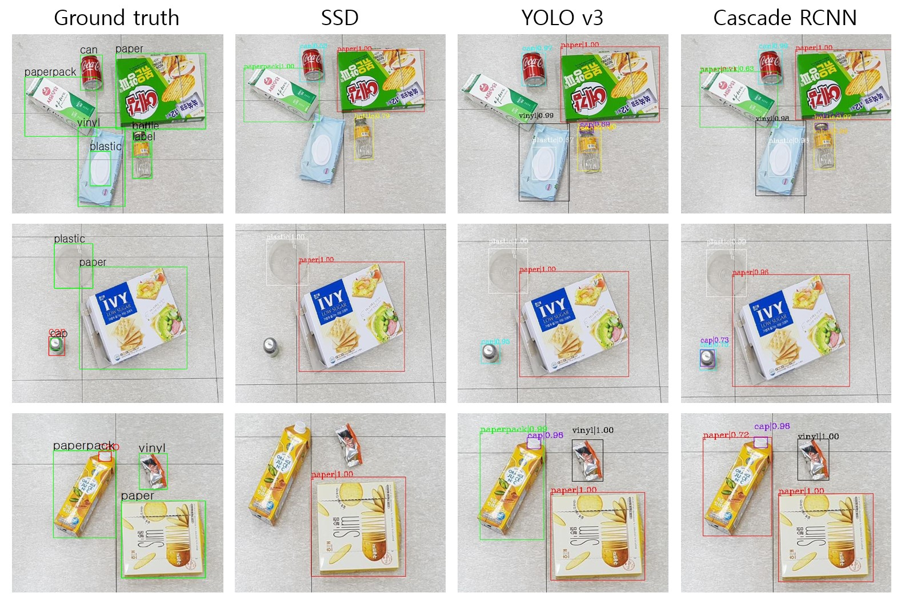

<p align="center">
<p align="center"></p>

**TOD** is large-scale high-resolution trash object datasets for solving trash-detection problems. It was intended for general household goods. And dataset was classified based on guidelines for separating and discharging recyclables from the Ministry of Environment. There were 10 categories, and 33,434 objects were annotated for 4977 images with 1280 x 720 resolution.


For convenience, annotations are provided in COCO data format.
If you want to know about more detail Data format reference    [COCO data format](http://cocodataset.org/#format-data, "coco data foramt")


## Models
**AP performance by Category of each model**

|  Model        | mAP  | Config         | Checkpoint    |
| ------------  | ---- | -------------- | ------------- |
| SSD           |0.310 | [Download](./configs/ssd512/ssd512_coco.py)   | [Download](https://koreaoffice-my.sharepoint.com/:u:/g/personal/jms0923_korea_edu/ETcLDNpppmNItbxc1hdmDTcBK1tkMo4-BgO7YanFZ-Nz6w?e=nb9i9p)  |
| YOLO v3       |0.445 | [Download](./configs/yolo_v3/yolov3_d53_mstrain-608_273e_coco.py)   | [Download](https://koreaoffice-my.sharepoint.com/:u:/g/personal/jms0923_korea_edu/EW3qGH8eB-JMrBAn6_m_enMBtijcT44HEpRF_MwzqCH0WA?e=KFGPZ5)  |
| Cascade RCNN  |0.432 | [Download](./configs/cascade_rcnn_r50_fpn_1x/cascade_rcnn_r50_fpn_1x_coco.py)   | [Download](https://koreaoffice-my.sharepoint.com/:u:/g/personal/jms0923_korea_edu/EeB-KAKms45AoSC2RtYuIJsBjJxKBXxTD60ktoYFpiB5Rw?e=NEfzyd)  |


## Getting started

1. **Install mmdetection**

   This implementation is based on [mmdetection](https://github.com/open-mmlab/mmdetection). Please refer to [INSTALL.md](https://github.com/open-mmlab/mmdetection/blob/master/docs/get_started.md) for installation and dataset preparation.

2. **Copy the codes to mmdetection directory**

   ```shell
   cp -r configs/ ${MMDETECTION_PATH}/
   ```

 3. **Prepare data**

    Download from [](https://doi.org/10.5281/zenodo.4607158)

     The directories should be arranged like this:
     
        >   mmdetection
        >     ├── mmdet
        >     ├── tools
        >     ├── configs
        >     ├── data
        >     │   ├── coco
        >     │   │   ├── annotations
        >     │   │   ├── train2017
        >     │   │   ├── val2017
        >     │   │   ├── test2017
        
 4. **Train with GPUs**

    ```shell
    CONFIG_FILE=configs/ ${CONFIG_FILE}
    ./ tools/dist_train.py ${CONFIG_FILE} ${NUM_GPUs}
    ```

 5. **Calculate parameters and flops**

     ```shell
      python tools/get_flops.py ${CONFIG_FILE} --shape $SIZE $SIZE
     ```

6. **Test**

   ```shell
   python tools/test.py ${CONFIG_FILE} ${CHECKPOINT_FILE} --out  ${OUTPUT_FILE} --eval bbox
   ```

More usages can reference [mmdetection documentation](https://mmdetection.readthedocs.io/en/latest/GETTING_STARTED.html#inference-with-pretrained-models).


## TODO
- [X] Release pre-train models.
- [ ] Update our arxiv paper.


### Contact
You can contact MinSeok Jo by sending email to jms0923@korea.ac.kr

***

***
